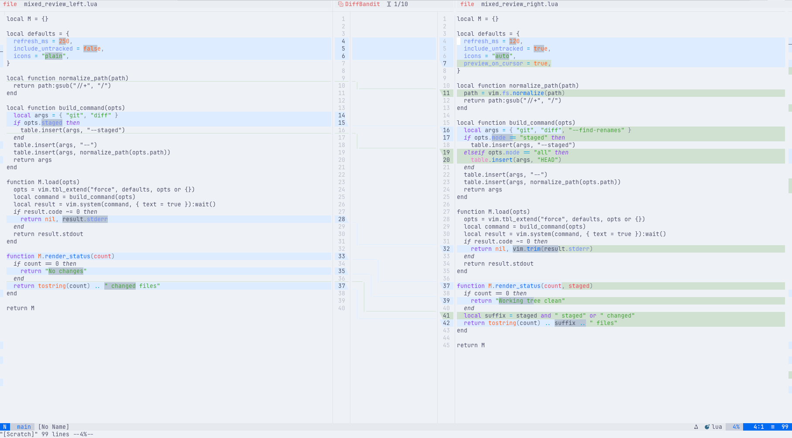
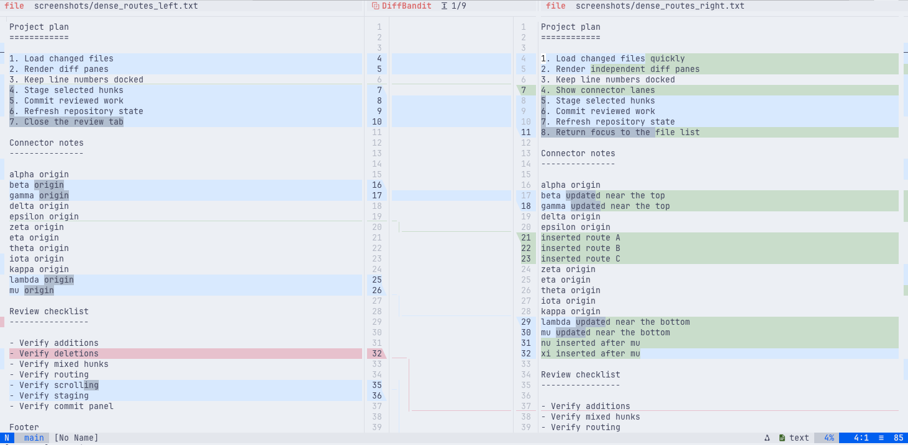
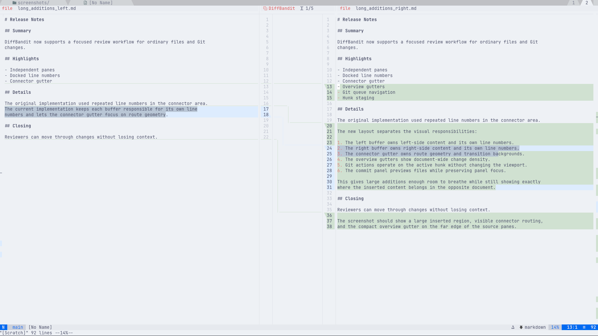
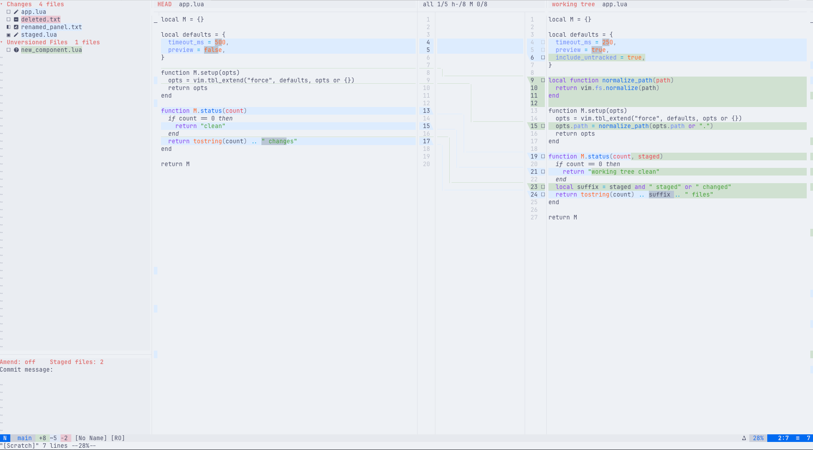
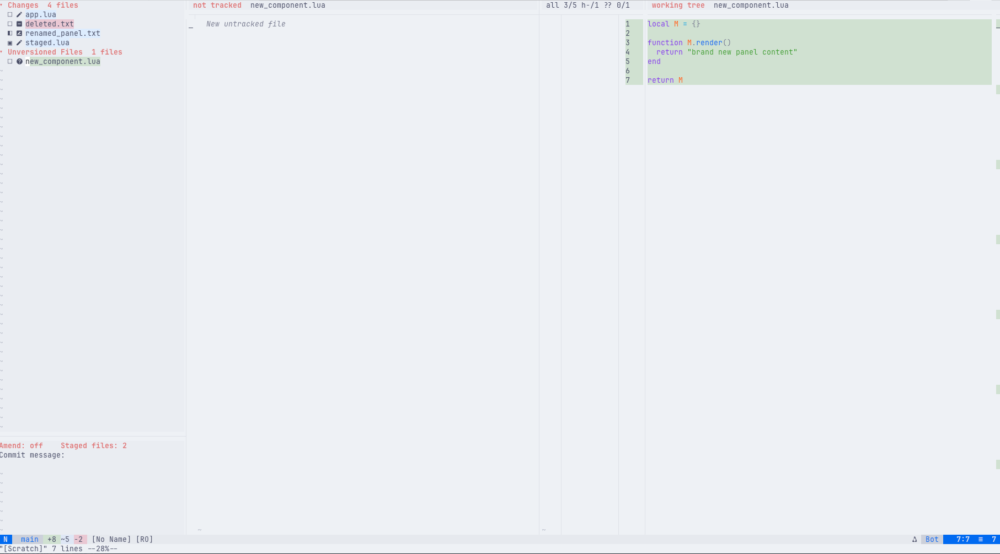
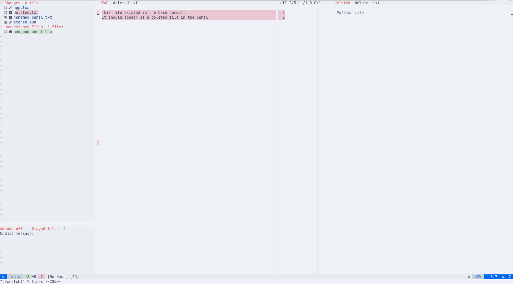
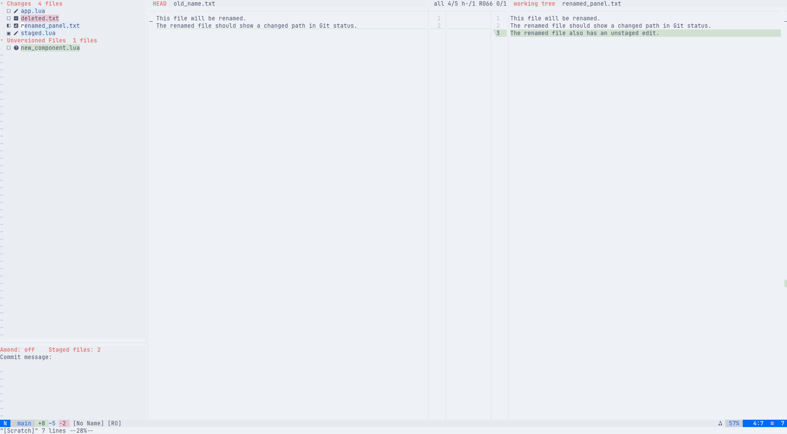
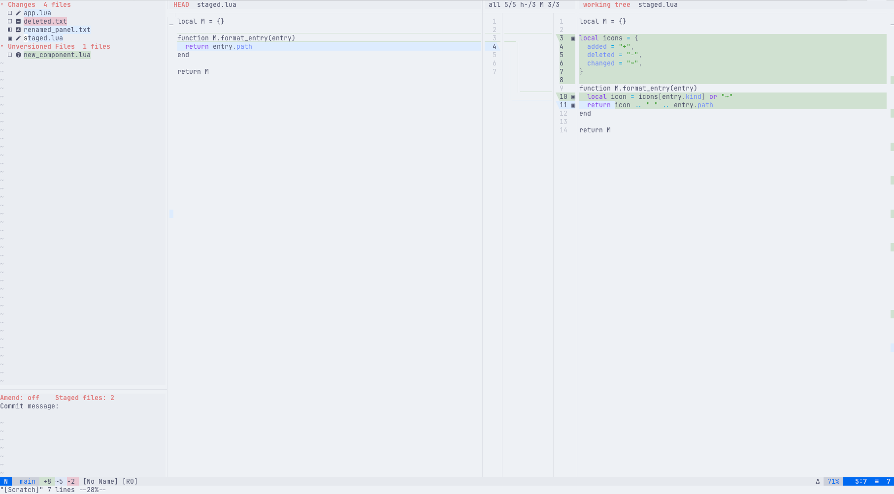
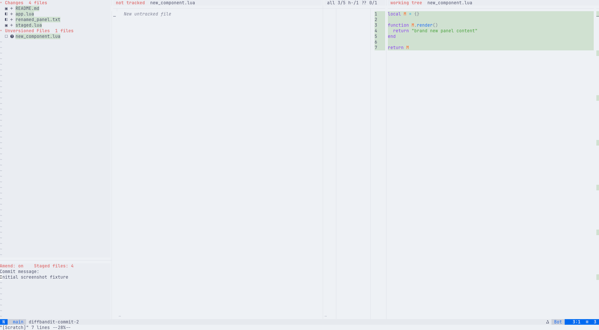

# diffbandit.nvim

[](https://github.com/CoreyKaylor/diffbandit.nvim/actions/workflows/ci.yml)

DiffBandit is a Neovim diff viewer with independent panes, compact connector
geometry, Git-aware navigation, hunk actions, a commit panel, binary hex diffs,
3-way merge conflict resolution, and theme-adaptive highlights.

It is designed to feel like a focused editor-native diff tool: source buffers
keep natural scrolling, line numbers stay docked to their side, and the middle
gutter shows the relationship between changed regions without repeating source
content.

## Features

- Three-part diff layout with left content, connector gutter, and right content.
- Independent source scrolling with synchronized line-number panes.
- Connector routes for additions, deletions, changes, mixed hunks, and
  scroll-clipped regions.
- Git queue navigation for changed files with `]f` and `[f`.
- Hunk staging, unstaging, discard/apply actions, and undo.
- Optional Git commit panel with file staging, amend mode, commit message entry,
  and live diff preview.
- Merge conflict group in the commit panel with a dedicated local/result/remote
  resolver.
- One-column overview gutters that show changed regions proportionally across
  each document.
- Binary file support through a read-only hex comparison view.
- Theme-friendly semantic colors derived from the active colorscheme, with
  optional overrides.
- Plain Unicode defaults with optional Nerd Font-style icon overrides.

## Requirements

- Neovim 0.10 or newer.
- Git for `:DiffBanditGit`, `:DiffBanditGitCurrent`, hunk actions, and the
  commit panel.
- tmux only for running the integration test suite.
- Nerd Fonts are optional.

## Installation

With `lazy.nvim`:

```lua
{
  "CoreyKaylor/diffbandit.nvim",
  config = function()
    require("diffbandit").setup()
  end,
}
```

## Quick Start

Compare two files:

```vim
:DiffBandit path/to/left path/to/right
```

Compare two loaded buffers by buffer number:

```vim
:DiffBanditBuffers 3 7
```

Open the current repository's changed files:

```vim
:DiffBanditGit
```

Open the current file as a Git diff:

```vim
:DiffBanditGitCurrent
```

Toggle the Git commit panel:

```vim
:DiffBanditCommitPanel
```

Resolve a Git conflict:

```vim
:DiffBanditMerge path/to/conflicted-file
```

## Screenshots

### Diff Views

<p>
  
</p>

<p>
  
</p>

<p>
  
</p>

### Git States

<p>
  
  
</p>

<p>
  
  
</p>

<p>
  
</p>

### Commit Panel

<p>
  
</p>

## Git Modes

`:DiffBanditGit` accepts common diff scopes:

```vim
:DiffBanditGit                 " all changes, including staged and unstaged
:DiffBanditGit --staged        " staged changes only
:DiffBanditGit --cached        " alias for --staged
:DiffBanditGit --all           " staged and unstaged changes
:DiffBanditGit --current       " current file scope
:DiffBanditGit --base main     " compare against a base revision
:DiffBanditGit --rev main..HEAD
:DiffBanditGit --no-untracked
:DiffBanditGit -- -- pathspec
```

By default, Git diffs use `all` mode and include untracked files.

## Default Keys

Inside a diff view:

| Key | Action |
| --- | --- |
| `]c` | Next hunk |
| `[c` | Previous hunk |
| `]f` | Next changed file in a Git queue |
| `[f` | Previous changed file in a Git queue |
| `[d` | Align both panes to the top of the documents |
| `]d` | Align both panes to the bottom of the documents |
| `C` | Open or focus the commit panel for the current Git file |
| `<Space>` | Toggle stage for the active Git hunk |
| `>>` | Apply the left side to the right target |
| `<<` | Apply the right side to the left target |
| `u` | Undo the last DiffBandit hunk action |
| `q` | Close the diff session |

At a file boundary, `]c` and `[c` first notify that the next press will move to
the next or previous file. This keeps hunk navigation deliberate while still
making multi-file Git review quick.

## Commit Panel

Open the panel with `:DiffBanditCommitPanel`, or press `C` from a Git diff
opened by `:DiffBanditGit`.

| Key | Action |
| --- | --- |
| `j` / `k` | Move through changed files and preview the selected file |
| `<CR>` | Focus the diff for the selected file |
| `]c` / `[c` | Navigate hunks in the selected file preview |
| `<Space>` | Toggle staged state for the selected file |
| `a` | Open file actions for the selected file |
| `cc` | Focus the commit message window |
| `<Space>` in the commit message window | Toggle amend mode |
| `:w` in the commit message window | Commit staged changes |
| `R` | Refresh the panel |
| `q` | Close the panel |

The panel validates empty commit messages and missing staged changes before
committing, and rejects commits while merge conflicts remain unresolved. In
amend mode, the panel compares against the previous commit so the file state
reflects what the amended commit would contain.

File actions include staging, unstaging, discarding unstaged tracked changes,
restoring deleted tracked files, deleting untracked files, and adding useful
`.gitignore` patterns for untracked files.

## Merge Conflicts

Conflict files appear in a `Merge Conflicts` group above normal changes in the
commit panel. Selecting a conflict opens a three-pane resolver:

- left: local/current Git stage (`ours`), read-only
- center: editable result, initialized from the base stage
- right: remote/incoming Git stage (`theirs`), read-only

Default merge keys:

| Key | Action |
| --- | --- |
| `]c` / `[c` | Next or previous conflict |
| `>>` | Accept local/current into the result |
| `<<` | Accept remote/incoming into the result |
| `gb` | Accept both sides, local then remote |
| `gA` | Apply non-conflicting changes from both sides |
| `:w` in the result pane | Write the result and mark the file resolved with `git add` |

DiffBandit warns when conflict stages have mixed line endings, but it does not
normalize them automatically.

## Hunk Actions

Git hunk actions operate on the active hunk in the right-side document pane:

- `<Space>` stages an unstaged hunk or unstages an already staged hunk in `all`
  mode.
- `>>` applies the left side of the hunk to the right target.
- `<<` applies the right side of the hunk to the left target.
- `u` undoes DiffBandit apply/stage actions in reverse order for the current
  file.

Staged hunks show an indicator next to the right-side line numbers. The default
symbols are plain Unicode squares so the UI remains usable without a patched
font.

## Binary Files

Binary files render as a read-only hex diff by default. Configure the hex view
with:

```lua
require("diffbandit").setup({
  ui = {
    hex = {
      enabled = true,
      bytes_per_row = 16,
      max_bytes = 65536,
      show_ascii = true,
      show_offsets = true,
    },
  },
})
```

Set `ui.hex.enabled = false` to show a compact binary-file notice instead.

## Configuration

Default setup:

```lua
require("diffbandit").setup()
```

Example with common customizations:

```lua
require("diffbandit").setup({
  diff = {
    algorithm = "myers",
    linematch = 60,
    ignore_whitespace = false,
  },
  navigation = {
    initial_focus = "right",
    align_on_jump = true,
    align_strategy = "change_top",
    document_keys = {
      top = "[d",
      bottom = "]d",
    },
  },
  git = {
    default_mode = "all",
    include_untracked = true,
    find_renames = true,
    file_keys = {
      next = "]f",
      prev = "[f",
    },
    panel = {
      width = 42,
      commit_height = 10,
      preview_on_cursor = true,
      keys = {
        toggle_stage = "<Space>",
        focus_diff = "<CR>",
        focus_panel = "C",
        focus_commit = "cc",
        file_actions = "a",
        toggle_amend = "<Space>",
        refresh = "R",
        close = "q",
      },
    },
  },
  merge = {
    result_initial_content = "base",
    auto_apply_non_conflicting = false,
    resolve_on_write = true,
    line_endings = {
      warn = true,
    },
    keys = {
      next_conflict = "]c",
      prev_conflict = "[c",
      accept_local = ">>",
      accept_remote = "<<",
      accept_both = "gb",
      apply_non_conflicting = "gA",
      focus_panel = "C",
      close = "q",
    },
  },
  ui = {
    connector_width = 12,
    scroll_debounce_ms = 16,
    split_blend = 0.3,
    overview = {
      enabled = true,
      width = 1,
      cursor = true,
    },
    status = {
      enabled = true,
      icons = "auto",
    },
    theme = {
      auto_refresh = true,
      semantic_blend = 0.3,
      change_emphasis_strength = 0.16,
      min_background_delta = 0.08,
      colors = {
        add = nil,
        delete = nil,
        change = nil,
        change_emphasis = nil,
      },
      highlights = {},
    },
  },
  actions = {
    staged_indicator = {
      unstaged = "□",
      staged = "▣",
    },
  },
})
```

Theme colors are derived from the active colorscheme's diff highlight groups.
Use `ui.theme.colors` for semantic color overrides, or `ui.theme.highlights` to
override specific `DiffBandit*` highlight groups.

## Lua API

```lua
local diffbandit = require("diffbandit")

diffbandit.setup({})
diffbandit.files("left.txt", "right.txt")
diffbandit.buffers(left_bufnr, right_bufnr)
diffbandit.git({ mode = "all" })
diffbandit.git_file(nil, { mode = "all" })
diffbandit.merge("path/to/conflicted-file")
diffbandit.commit_panel({})
```

Hunk actions are also exposed as Lua functions:

```lua
diffbandit.toggle_stage_hunk()
diffbandit.stage_hunk()
diffbandit.unstage_hunk()
diffbandit.discard_hunk()
diffbandit.apply_left_hunk()
diffbandit.apply_right_hunk()
diffbandit.undo()
```

## Testing

Run the unit/spec suite:

```bash
nvim --headless -u tests/run.lua
```

Run the tmux integration suite:

```bash
tests/integration/run.sh
```

The integration tests capture terminal output, including ANSI highlights, so
they can verify connector geometry, backgrounds, underline spans, Git actions,
commit panel behavior, binary diffs, and scrolling behavior.

## License

diffbandit.nvim is licensed under the Apache License, Version 2.0. See
[`LICENSE`](LICENSE).
